# 🛡️ Zyn Protocol

**Zyn Protocol** is a minimalist, high-privacy stealth payment system for ENS. It implements a "Zero-Link" architecture where identity and financial data are completely decoupled through stateless smart contracts and client-side cryptography.

## 🚀 Key Features

- **Stateless Registration**: Subdomains are registered to the contract itself, breaking the on-chain link between your wallet and your ENS name.
- **Official ENS Integration**: All stealth metadata is stored as standard text records on the **Official ENS Public Resolver**, ensuring your identity lives on decentralized infrastructure.
- **CCIP-Read Resolution**: EIP-3668 compliant gateway allows any standard Ethereum wallet (MetaMask, Rainbow, etc.) to resolve `.zyn.eth` names to one-time stealth addresses.
- **EIP-5564 Compliant**: Uses standard secp256k1 stealth address generation with 1-byte view tags for fast scanning.
- **Private Announcements**: Uses an ephemeral announcer contract to post encrypted "clues" on-chain, allowing recipients to discover payments without revealing the sender.

---

---

## 📖 Subdomain Registration Flow (Full Lifecycle)

The registration of a Zyn subdomain is a carefully orchestrated process designed to break the link between your public identity and your private funds.

### 1. Local Identity Generation (Frontend)
The user's browser generates a pair of cryptographic keys (Spending & Viewing) from a signature. These are used to create the **Stealth Meta-Address**.
*   **Why:** We generate these locally so your private keys **never touch a server**. The Meta-Address is the only thing the world sees; it's like a "public mailbox ID" that doesn't reveal who you are.

### 2. The Availability Check
The frontend calls `isAvailable(name)` on the `SubdomainRegistrar` contract.
*   **Why:** Since ENS is a global namespace, we must ensure the name hasn't already been claimed. This check looks directly at the **ENS Registry** to see if the owner of that name is currently `address(0)`.

### 3. The "Zero-Link" Registration (The Transaction)
The user sends a transaction to `SubdomainRegistrar.register(name, metaAddress)`. This triggers two critical internal steps:

#### A. Ownership Redirection (`setSubnodeRecord`)
The contract tells the ENS Registry to create the subdomain and set the **Registrar Contract** as the owner.
*   **Why:** If *you* were the owner, your wallet address would be permanently linked to your ENS name in the registry logs. By making the **contract** the owner, the trail ends there. Anyone looking at the registry just sees that the Zyn Registrar owns the name.

#### B. Resolver Assignment
The contract sets the name's resolver to the custom **`StealthResolver`**.
*   **Why:** This tells the world: *"If you want to send money to this user, don't ask the standard ENS system; ask the Zyn CCIP-Read bridge instead."*

### 4. Storage of the "Secret" Record (`setText`)
The contract calls `officialResolver.setText(subnode, "stealth", metaAddress)`.
*   **Why:** We store the meta-address on the **Official ENS Public Resolver** rather than a custom database. This ensures your data is as decentralized and permanent as any other ENS name.

### 5. Event Emission (`NameRegistered`)
The contract emits an event with the name and meta-address.
*   **Why:** This allows the **Indexer (The Graph)** to pick up the registration instantly. While the ENS Registry is private, the protocol needs to index these registrations so users can see their active identities in the Dashboard.

---

## 💸 The Zyn Payment Lifecycle (Technical Deep-Dive)

This section outlines the exact path a payment takes through the protocol, from discovery to withdrawal.



### 1. Setup (The Recipient)
*   **Key Generation**: Recipient generates a **Stealth Meta-Address** locally via a signature-derived entropy source.
    *   *Ref:* [`main-app/lib/keys.ts`](file:///d:/Web3/zyn/main-app/lib/keys.ts) -> `generateStealthKeypairs`
    *   **Why:** Privacy begins with local entropy. By generating these keys from a signature, we ensure the server never sees the private "master" keys.
*   **Zero-Link Registration**: Recipient registers a name (e.g., `alice.zyn.eth`) where the **Registrar Contract** is the owner.
    *   *Ref:* [`hardhat/contracts/SubdomainRegistrar.sol`](file:///d:/Web3/zyn/hardhat/contracts/SubdomainRegistrar.sol) -> `register`
    *   **Why:** If the user were the owner, their wallet would be permanently linked to the name. Making the contract the owner breaks the on-chain trail.
*   **Standard Storage**: The meta-address is stored in the **Official ENS Public Resolver**.
    *   *Ref:* [`hardhat/contracts/SubdomainRegistrar.sol`](file:///d:/Web3/zyn/hardhat/contracts/SubdomainRegistrar.sol) -> `officialResolver.setText`
    *   **Why:** This ensures data is permanent and follows ENS standards, making it compatible with any wallet that knows how to read ENS text records.

### 2. Discovery & Math (The Sender)
*   **Resolution**: Sender fetches the Meta-Address record using Alice's ENS name.
    *   *Ref:* [`main-app/lib/ens.ts`](file:///d:/Web3/zyn/main-app/lib/ens.ts) -> `getStealthMetaAddress`
    *   **Why:** The sender needs the recipient's public keys to "blind" the payment address.
*   **Stealth Generation**: Sender's browser computes a one-time **Stealth Address** and an **Ephemeral Public Key** (clue).
    *   *Ref:* [`main-app/lib/stealth.ts`](file:///d:/Web3/zyn/main-app/lib/stealth.ts) -> `generateStealthAddress`
    *   **Why:** The stealth address (0xABC...) is unique and has no history. This prevents "address reuse" and makes it impossible for observers to know who the recipient is.

### 3. Execution & Privacy (The Handshake)
*   **Direct Transfer**: Sender sends ETH directly to the generated Stealth Address.
    *   **Why:** The money sits on a fresh address that only the recipient can unlock.
*   **Relayed Announcement**: Sender sends the ephemeral key to the **Zyn Relayer** to be posted on-chain.
    *   *Ref:* [`main-app/app/api/relay-announce/route.ts`](file:///d:/Web3/zyn/main-app/app/api/relay-announce/route.ts)
    *   **Why:** If the sender posted the clue directly, their wallet would be linked to the payment. The relayer acts as an anonymity bridge for the notification.
*   **Stateless Event**: The contract emits an `Announcement` event. No data is stored in contract state.
    *   *Ref:* [`hardhat/contracts/EphemeralAnnouncer.sol`](file:///d:/Web3/zyn/hardhat/contracts/EphemeralAnnouncer.sol) -> `announce`
    *   **Why:** Events are significantly cheaper than storage. This keeps the cost of private payments nearly identical to public ones.

### 4. Discovery & Sweep (The Recipient)
*   **Instant Indexing**: The Graph Subgraph picks up the event and indexes the `viewTag` for fast retrieval.
    *   *Ref:* [`indexer/src/ephemeral-announcer.ts`](file:///d:/Web3/zyn/indexer/src/ephemeral-announcer.ts)
    *   **Why:** Scanning the whole blockchain is slow. The indexer provides a fast, filtered API for the dashboard.
*   **Private Scanning**: Recipient's browser queries the Indexer and uses the **Private Viewing Key** to "unlock" the math and find their funds.
    *   *Ref:* [`main-app/components/SweepDashboard.tsx`](file:///d:/Web3/zyn/main-app/components/SweepDashboard.tsx) -> `checkStealthAddress`
    *   **Why:** The indexer doesn't know who is querying. Only the recipient's local browser can verify if a payment belongs to them.
*   **Recovery**: Recipient derives the one-time **Spending Private Key** and sweeps the funds.
    *   *Ref:* [`main-app/components/SweepDashboard.tsx`](file:///d:/Web3/zyn/main-app/components/SweepDashboard.tsx) -> `onSweep`
    *   **Why:** The recipient combines their base spending key with the sender's clue to "derive" the final private key for the one-time address.

---

## 🛠️ Tech Stack

- **Frontend**: Next.js 16 (Turbopack), TailwindCSS, Shadcn/UI.
- **Web3**: Wagmi, Viem, ENS SDK.
- **Smart Contracts**: Solidity 0.8.27, Hardhat, OpenZeppelin.
- **Gateway**: Next.js API Routes (EIP-3668).

---

## 🔍 Technical Deep-Dive: Next.js (Frontend & Gateway)

### 1. CCIP-Read Resolution (EIP-3668)
The project implements a **CCIP-Read Gateway** in `/app/api/resolve/route.ts`. When a wallet (like MetaMask) attempts to resolve `alice.zyn.eth`, the `StealthResolver` contract tells the wallet to fetch data from our API.
- **Logic**: The API fetches Alice's "Meta-Address" from the Official ENS Public Resolver and performs the elliptic curve derivation on the fly.
- **Security**: Responses are signed by the `RELAYER_PRIVATE_KEY`. The contract verifies this signature on-chain before returning the address, ensuring the gateway cannot lie about the result.

### 2. Client-Side Payment Recovery
All "View" and "Spend" keys are generated locally and encrypted using a wallet-signed master key.
- **Scanning**: The `SweepDashboard` queries the `EphemeralAnnouncer` logs. It performs the "Stealth Match" math entirely in the browser. 
- **Privacy**: No private keys or viewing secrets are ever sent to the server or RPC. The RPC only sees requests for raw event data.

---

## ⛓️ Technical Deep-Dive: Hardhat (Contracts)

### 1. Ephemeral Bulletin Board (EIP-5564)
The `EphemeralAnnouncer` is a gas-optimized "bulletin board."
- **Efficiency**: It uses **zero storage**. It only emits events. This reduces the cost of "announcing" a payment by ~90% compared to traditional on-chain state.
- **Standard**: It follows EIP-5564, using the `Announcement` event format that is compatible with future stealth-address explorers.

### 2. Stateless Subdomain Registration
The `SubdomainRegistrar` is an "Orphan Maker."
- **Ownership**: When you register `name.zyn.eth`, the contract sets **itself** as the owner in the ENS Registry. 
- **Link Breaking**: Because the contract owns the name, there is no `ownerOf` record pointing to your wallet. The only link to your identity is the text record pointing to your meta-address, which is itself a "silent" public key.

---

## 🚦 Getting Started

### 1. Smart Contracts (Hardhat)
```bash
cd hardhat
npm install
npx hardhat compile
npx hardhat run scripts/deploy.ts --network sepolia
```

### 2. Frontend (Main App)
```bash
cd main-app
pnpm install
pnpm dev
```

### 3. Environment Setup (`.env.local`)
The deployment script automatically generates these, but ensure they are set:
- `NEXT_PUBLIC_SUBDOMAIN_REGISTRAR_ADDRESS`: The registrar contract.
- `NEXT_PUBLIC_STEALTH_RESOLVER_ADDRESS`: The CCIP-Read resolver.
- `NEXT_PUBLIC_EPHEMERAL_ANNOUNCER_ADDRESS`: The announcement board.
- `RELAYER_PRIVATE_KEY`: Hex-encoded key for signing CCIP responses.

---

## ⚠️ Important ENS Manager Steps

To make the system functional on Sepolia:
1.  **Add Controller**: You MUST add the `SubdomainRegistrar` contract address as a **Controller/Manager** for `zyn.eth` in the [ENS Manager](https://app.ens.domains/).
2.  **Set Resolver**: Ensure `zyn.eth` is using the Official Public Resolver (not the StealthResolver itself). The system handles the rest.

---


---

## 📄 License
MIT
